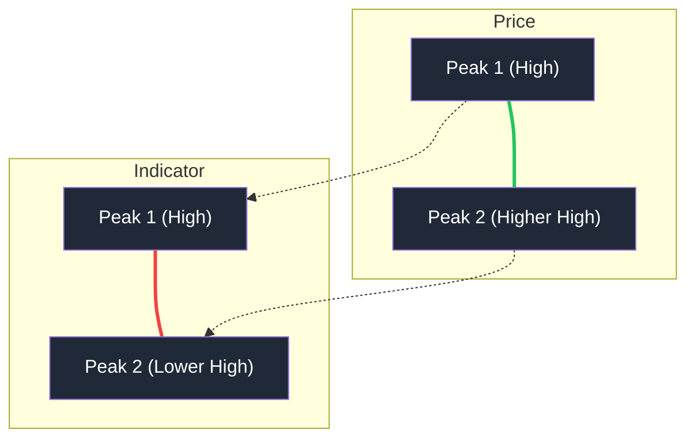
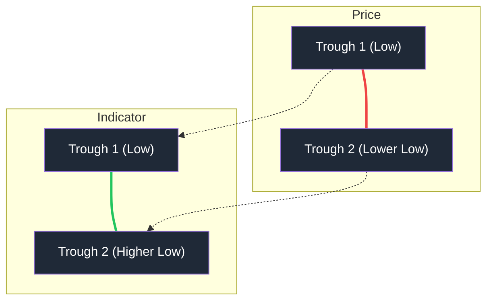

# 🧠 Divergence Detection Algorithm

The Stock Intelligence Suite uses a custom "Wave-based" algorithm to detect reliable divergences, specifically designed to filter out noise and identify high-conviction reversal signals.

## 1. Wave Identification
Instead of comparing raw daily slopes, the system segments the indicator data (MACD Histogram or Force Index) into **Waves**. A wave is defined as a contiguous sequence of values on one side of the zero-line.

*   **Zero-Line Crossing**: A new wave starts whenever the indicator crosses the zero-line. This ensures that divergences are compared across distinct momentum shifts.

## 2. Extrema Extraction
For each wave, the algorithm extracts two critical data points:
*   **Indicator Extrema**: The maximum momentum value (Peak) or minimum momentum value (Trough) within the wave.
*   **Price at Extrema**: The actual High or Low reached during the **entire wave segment**.
    *   For **Peaks** (Positive Indicator): The **Maximum High** reached within the segment is recorded.
    *   For **Troughs** (Negative Indicator): The **Minimum Low** reached within the segment is recorded.

## 3. Divergence Comparison Logic
The system compares the **current active wave** with a **previous historical wave** of the same polarity.

### 🔍 Multi-Segment Lookback (Noise Resistance)
To protect against market "noise" and minor indicator fluctuations, the algorithm searches back through recent historical waves.

### ⛓️ Elder's Constraints (Cycle Filtering)
To ensure the divergence is logically consistent and doesn't cross multiple unrelated market cycles:
*   **Bridge Wave Limit**: A divergence **must** cross exactly **1 intervening wave** of the opposite polarity (e.g., POS -> NEG -> POS). This prevents linking two distant price peaks that are separated by multiple momentum shifts.
*   **Distance Limit**: The two extrema must occur within **40 bars** (approx. 2 months for Daily charts) of each other.

### 📉 Bearish Divergence (Reversal Signal)
Occurs during an uptrend when price momentum is fading.

*   **Price Condition**: Current Peak High >= (Previous Peak High * 0.995). 
    *   *Note: Includes "Higher Highs" and strict "Double Tops" within a 0.5% tolerance.*
*   **Indicator Condition**: Current Peak Value < Previous Peak Value (A "Lower High" in momentum/volume).
*   **Confirmation**: There must be at least one complete negative wave (zero-crossing) between the two peaks.

### 📈 Bullish Divergence (Bottoming Signal)
Occurs during a downtrend when selling pressure is exhausting.

*   **Price Condition**: Current Trough Low <= (Previous Trough Low * 1.005).
    *   *Note: Includes "Lower Lows" and strict "Double Bottoms" within a 0.5% tolerance.*
*   **Indicator Condition**: Current Trough Value > Previous Trough Value (A "Higher Low" in momentum/volume).
*   **Confirmation**: There must be at least one complete positive wave (zero-crossing) between the two troughs.

## 4. Signal Confirmation (Zero-Lag Prevention)
To prevent "premature" signals that might trigger on the very day a peak is forming (and then disappear if price continues to trend), the system requires:
*   **1-Bar Lag**: The extrema (peak/trough) must be at least one candle in the past.
*   **Reversal Confirmation**: The indicator must have explicitly "ticked" back toward the zero-line from its extrema (Ticked down for Bearish, Ticked up for Bullish).

## 5. Dual Divergence (High Confluence)
A **Dual Divergence** alert is triggered when both **MACD (Momentum)** and **Force Index 13 (Volume Pressure)** detect the same type of divergence simultaneously. This represents a powerful confluence of fading momentum and decreasing institutional participation.

## 6. Signal Cancellation (Invalidation)
A divergence signal is considered **cancelled** or invalidated if any of the following occur:
*   **Momentum New High/Low**: If the current wave's indicator value exceeds the previous peak (Bearish) or drops below the previous trough (Bullish), the "momentum exhaustion" has failed, and the divergence is void.
*   **Cycle Breakup**: If the indicator crosses the zero-line more than once between the two peaks/troughs (Bridge > 1), the pattern is considered too complex/unreliable and is ignored.
*   **Time Decay**: If more than **40 bars** pass between the two extrema, the signals are considered "decoupled" and no longer part of the same market structure.
*   **Price Breakout**: If the price continues to trend decisively against the signal before the "tick back" confirmation, the pattern is usually abandoned by the algorithm.

## 7. Recency & Freshness
To ensure the suite provides actionable data, the algorithm applies two layers of filtering:
*   **SCAN Freshness (1 Week)**: In the master scanner and dashboard alerts, a signal is only reported if the most recent extrema (S2) occurred within the last **5 trading bars**. This ensures you only see "fresh" opportunities.
*   **Chart History (1 Month)**: When viewing an individual stock, the algorithm will draw and display historical divergences up to **30 bars** old to provide context for recent price action.
