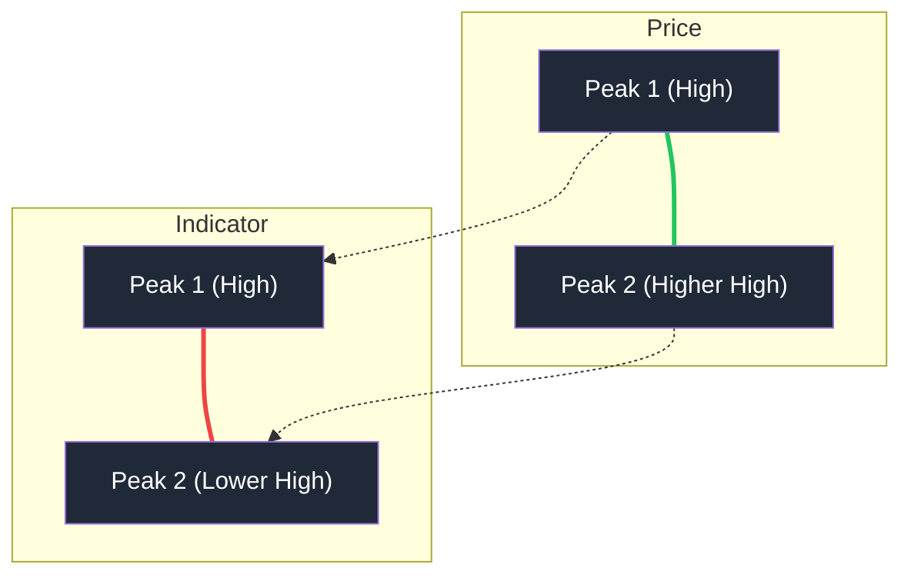
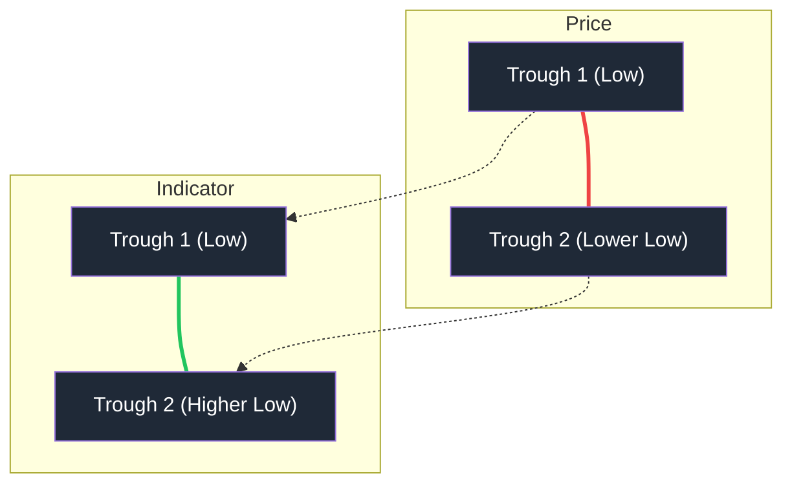

# 🧠 Divergence Detection Algorithm

The Stock Intelligence Suite uses a custom "Wave-based" algorithm to detect reliable divergences, specifically designed to filter out noise and identify high-conviction reversal signals.

## 1. Wave Identification
Instead of comparing raw daily slopes, the system segments the indicator data (MACD Histogram or Force Index) into **Waves**. A wave is defined as a contiguous sequence of values on one side of the zero-line.

*   **Zero-Line Crossing**: A new wave starts whenever the indicator crosses the zero-line. This ensures that divergences are compared across distinct momentum shifts.

## 2. Extrema Extraction
For each wave, the algorithm extracts two critical data points:
*   **Indicator Extrema**: The maximum value for a positive wave (Peak) or the minimum value for a negative wave (Trough).
*   **Price at Extrema**: The corresponding Stock Price at the exact same point in time.
    *   For **Peaks** (Positive Indicator): High Price is recorded.
    *   For **Troughs** (Negative Indicator): Low Price is recorded.

## 3. Divergence Comparison Logic
The system compares the **current active wave** with the **most recent previous wave** of the same polarity.

### 📉 Bearish Divergence (Reversal Signal)
Occurs during an uptrend when price momentum is fading.

*   **Price Condition**: Current Peak High > Previous Peak High (A "Higher High" in price).
*   **Indicator Condition**: Current Peak Value < Previous Peak Value (A "Lower High" in momentum/volume).
*   **Confirmation**: There must be at least one complete negative wave (zero-crossing) between the two peaks.

### 📈 Bullish Divergence (Bottoming Signal)
Occurs during a downtrend when selling pressure is exhausting.

*   **Price Condition**: Current Trough Low < Previous Trough Low (A "Lower Low" in price).
*   **Indicator Condition**: Current Trough Value > Previous Trough Value (A "Higher Low" in momentum/volume).
*   **Confirmation**: There must be at least one complete positive wave (zero-crossing) between the two troughs.

## 4. Dual Divergence (High Confluence)
A **Dual Divergence** alert is triggered when both **MACD (Momentum)** and **Force Index 13 (Volume Pressure)** detect the same type of divergence simultaneously. This represents a powerful confluence of fading momentum and decreasing smart-money participation, making it one of the most reliable signals in the suite.

## 5. Recency Filter
To ensure relevance, an alert is only displayed if the extrema of the current wave occurred within the last **10-15 bars** (depending on the specific indicator).
