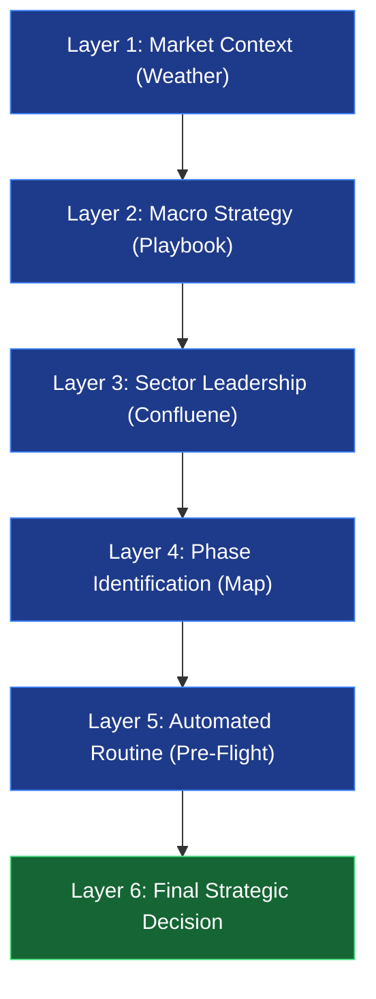
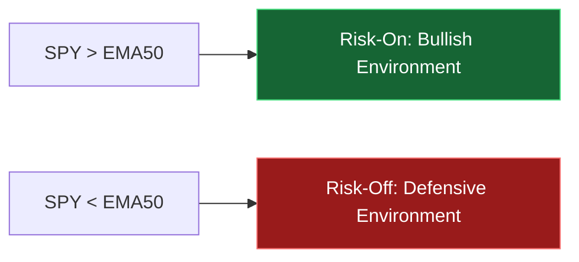
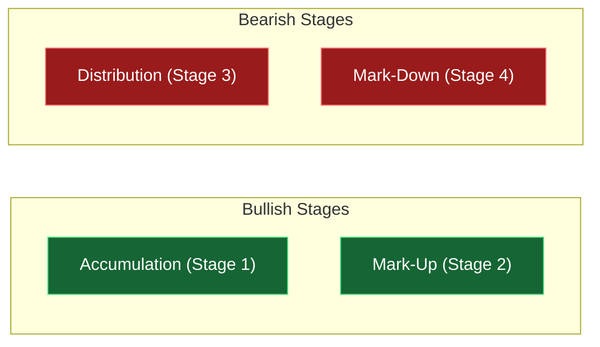
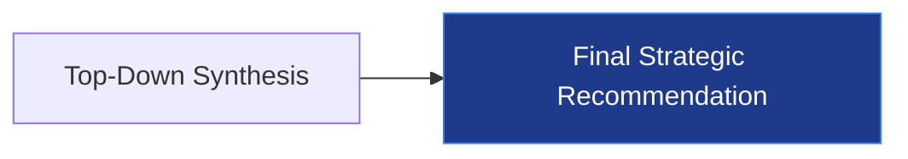

# 🧠 Market Intelligence Engine: Technical & Strategic Logic

The Market Intelligence dashboard is the "brain" of the Stock Intelligence Suite. It automates a professional Top-Down analysis routine, correlating macro-economic factors with individual stock technicals to determine the highest-probability trading regimes.

---

## 🏗️ The Multi-Layer Logic Flow

The engine processes data in six distinct layers, moving from the broadest (Global Macro) to the most specific (Individual Confluence).

---

### Layer 1: Market Context (The "Weather")
The system first looks at the **SPY (S&P 500)** relative to its **50-day EMA** and identifies the core macro tides. 

#### 💡 Why it matters:
Trading against the broad market is like swimming against a tsunami. Layer 1 protects your capital by providing a "Go/No-Go" signal. When the market is **Risk-Off**, even the best technical setups have a significantly higher failure rate.

---

### Layer 2: Macro Strategy (The "Playbook")
The engine identifies the active macro regime by combining Growth (XLI), Inflation (TIP), and Liquidity (^TNX) trends.

#### 💡 Why it matters:
Institutional "Smart Money" moves based on these three pillars. Layer 2 tells you which "Neighborhood" of the market is currently backed by economic tailwinds, helping you avoid "fighting the fed."

---

### Layer 3: Sector Leadership (The "Confluence")
The system compares the relative performance of the stock's sector against the active **Macro Strategy**.

#### 💡 Why it matters:
A stock in a sector outperforming the S&P 500 is **market-leading**. This layer ensures you aren't just buying a good company, but one currently in a "Leading Sector" with institutional momentum.

---

### Layer 4: Phase Identification (The "Map")
Using the 50-day and 200-day EMAs, the system classifies the stock into its technical stage:

#### 💡 Why it matters:
Retail traders often buy "Stage 4" (Mark-Down) stocks thinking they are a bargain. Layer 4 forces you to trade only in **Stage 2** (Uptrend) or **Stage 1** (Accumulation), aligning you with the technical path of least resistance.

---

### Layer 5: Automated Routine (The "Pre-Flight")
A real-time checklist verifies if the specific stock entry matches the requirements of a high-probability trade.

#### 💡 Why it matters:
Discipline is the difference between a trader and a gambler. The automated routine removes emotional bias by ensuring every condition (Macro Trend, Sector Leadership, Stage, and Confluence) is met before committing capital.

---

### Layer 6: Final Strategic Decision (The "Verdict")
The system harmonizes all layers into a final, actionable instruction.

### 💡 The Big Picture
By the time you reach the "Final Decision," the engine has filtered out thousands of low-probability noise signals, leaving you with only the trades where the **Weather**, the **Playbook**, the **Neighborhood**, and the **Routine** are all in your favor.
