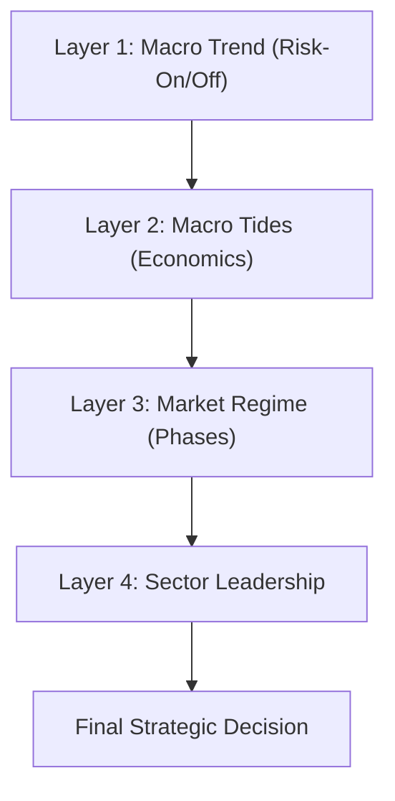

# 🧠 Market Intelligence Engine: Technical & Strategic Logic

The Market Intelligence dashboard is the "brain" of the Stock Intelligence Suite. It automates a professional Top-Down analysis routine, correlating macro-economic factors with individual stock technicals to determine the highest-probability trading regimes.

---

## 🏗️ The Multi-Layer Logic Flow

The engine processes data in four distinct layers, moving from the broadest (Global Macro) to the most specific (Individual Confluence).

---

### Layer 1: Global Macro Trend (The "Weather")
The system first looks at the **SPY (S&P 500)** relative to its **50-day EMA**. 
*   **Risk-On**: SPY > EMA50. The environment is favorable for growth and momentum strategies.
*   **Risk-Off**: SPY < EMA50. The environment is defensive; technical setups are prone to failure.

---

### Layer 2: Macro Tides (The "Currents")
The engine monitors three critical proxies to determine the current economic "climate."

| Current | Proxy | Logic | Impact |
| :--- | :--- | :--- | :--- |
| **Growth** | **XLI** (Industrials) | XLI > EMA50 = Expanding | **Expanding**: Favor Tech/Growth/Cyclicals. |
| **Inflation** | **TIP** (Inflation Bonds) | TIP < EMA50 = Rising Pressure | **Rising**: Favor Commodities/Energy/Staples. |
| **Liquidity** | **^TNX** (10Y Yields) | TNX < EMA50 = Easing | **Easing**: Favor Small Caps/Forward Tech/Financials. |

#### Strategic Playbooks
By combining these tides, the system identifies a **Macro Playbook**:
*   **Goldilocks Zone**: Expanding Growth + Easing Liquidity. (High-Beta Tech/Growth focus).
*   **Stagflation Risk**: Slowing Growth + Rising Inflation. (Energy/Commodities/Staples focus).
*   **Late Cycle Expansion**: Expanding Growth + Tightening Liquidity. (Financials/Value focus).
*   **Early Cycle Recovery**: Slowing Growth + Easing Liquidity. (Small Caps/Growth focus).

---

### Layer 3: Market Regime Detection (The "Map")
Using the 50-day and 200-day EMAs, the system classifies the stock into one of Stan Weinstein's classic market phases:

1.  **Mark-Up (Stage 2)**: Price > EMA50 > EMA200. Established uptrend.
2.  **Distribution (Stage 3)**: Price < EMA50 while Averages are flat/topping. Topping behavior.
3.  **Mark-Down (Stage 4)**: Price < EMA50 < EMA200. Established downtrend.
4.  **Accumulation (Stage 1)**: Price > EMA50 while Averages are flat/bottoming. Smart money absorption.

#### Confluence Score (0-3)
A reliability rating is assigned based on the alignment of three independent layers:
*   **Trend**: Is the stock in a Mark-Up/Down phase?
*   **Momentum**: Is the RSI > 50 (Bullish) or < 50 (Bearish)?
*   **Flow (Volume)**: Is current volume higher than the 20-day average?

---

### Layer 4: Sector Leadership & Alignment
The engine calculates the 1-month relative performance of all major S&P sectors (XLK, XLE, XLF, etc.) and compares the stock's own sector against the **Macro Playbook**.

*   **Aligned**: Stock is in a sector favored by the current Macro tides (e.g., Tech in Goldilocks).
*   **Unaligned**: Stock is trending, but its sector is fighting macro headwinds.

---

## 🎯 The Final Strategic Decision
The system harmonizes all layers into a final instruction. Examples:

*   **Strong Buy**: All cylinders are firing. (Mark-Up + Risk-On + Aligned Sector + High Confluence).
*   **Avoid / Short**: Low-conviction technicals fighting a Stagflationary or Deflationary macro tide.
*   **Speculative Bullish**: Strong individual trend, but the sector lacks macro tailwinds.
*   **Wait for Entry**: Macro is favorable, but the technical trend (Mark-Up) has not yet triggered.
