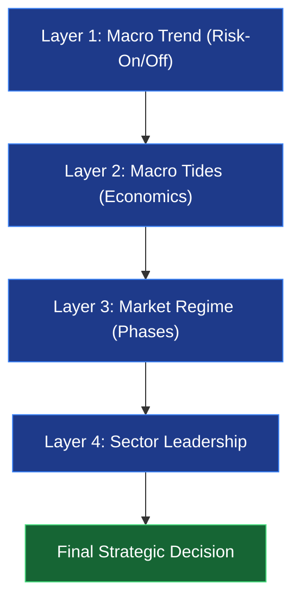
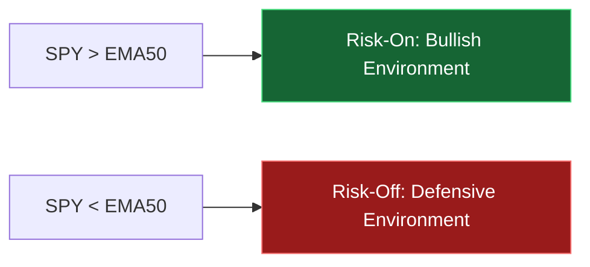
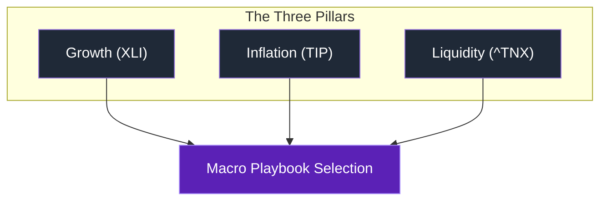
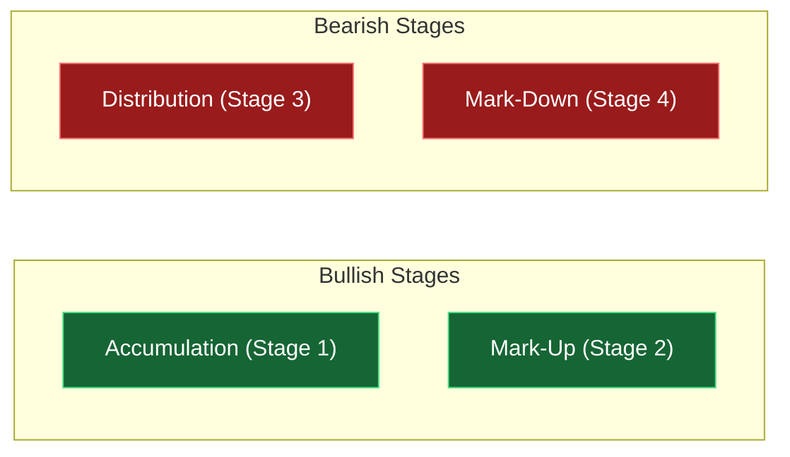
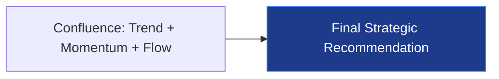

# 🧠 Market Intelligence Engine: Technical & Strategic Logic

The Market Intelligence dashboard is the "brain" of the Stock Intelligence Suite. It automates a professional Top-Down analysis routine, correlating macro-economic factors with individual stock technicals to determine the highest-probability trading regimes.

---

## 🏗️ The Multi-Layer Logic Flow

The engine processes data in four distinct layers, moving from the broadest (Global Macro) to the most specific (Individual Confluence).

---

### Layer 1: Global Macro Trend (The "Weather")
The system first looks at the **SPY (S&P 500)** relative to its **50-day EMA**. 

#### 💡 Why it matters:
Trading against the broad market is like swimming against a tsunami. Layer 1 protects your capital by providing a "Go/No-Go" signal. When the market is **Risk-Off**, even the best technical setups have a significantly higher failure rate.

---

### Layer 2: Macro Tides (The "Currents")
The engine monitors three critical proxies to determine the current economic "climate."

#### Strategic Playbooks
By combining these tides, the system identifies the active macro regime:

| Playbook | Tides | User Focus |
| :--- | :--- | :--- |
| **Goldilocks Zone** | Expanding + Easing | High-Beta Tech & Growth |
| **Stagflation Risk** | Slowing + Rising Inflation | Energy, Staples, & Gold |
| **Late Cycle** | Expanding + Tightening | Financials & Value |
| **Recovery** | Slowing + Easing | Small Caps & Forward Tech |

#### 💡 Why it matters:
Institutional "Smart Money" moves based on these three pillars. Layer 2 tells you which "Neighborhood" of the market is currently backed by economic tailwinds, helping you avoid "fighting the fed."

---

### Layer 3: Market Regime Detection (The "Map")
Using the 50-day and 200-day EMAs, the system classifies the stock into its technical stage:

#### 💡 Why it matters:
Most retail traders lose money by buying "Stage 4" (Mark-Down) stocks thinking they are a bargain. Layer 3 forces you to trade only in **Stage 2** (Uptrend) or **Stage 1** (Accumulation), aligning you with the technical path of least resistance.

---

### Layer 4: Sector Leadership & Alignment
The engine calculates the 1-month relative performance of all major S&P sectors and compares the stock's own sector against the active **Macro Playbook**.

#### 💡 Why it matters:
A stock in a sector outperforming the S&P 500 is **market-leading**. This layer ensures you aren't just buying a good company, but one currently in a "Leading Sector" with institutional momentum.

---

## 🎯 The Final Strategic Decision
The system harmonizes all layers into a final instruction.

### 💡 The Big Picture
By the time you reach the "Final Decision," the engine has filtered out thousands of low-probability noise signals, leaving you with only the trades where the **Weather**, the **Currents**, the **Map**, and the **Neighborhood** are all in your favor.
