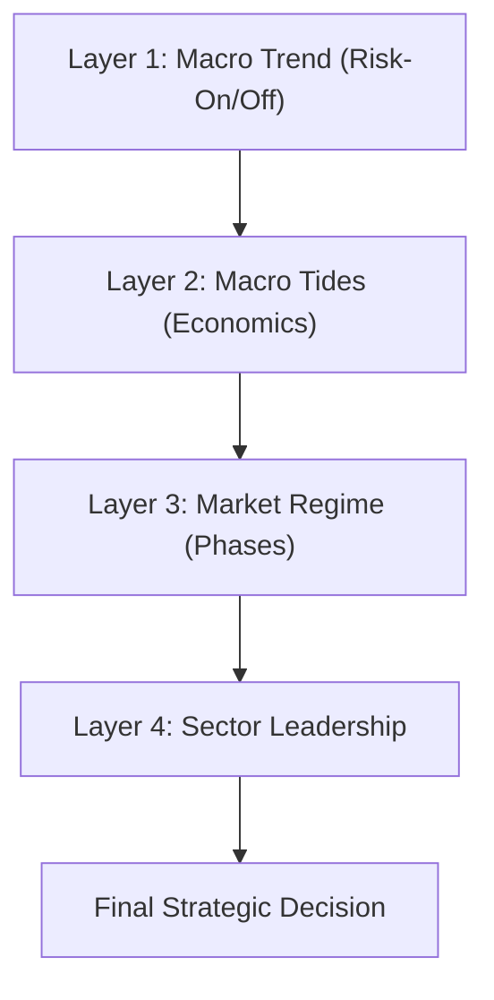

# 🧠 Market Intelligence Engine: Technical & Strategic Logic

The Market Intelligence dashboard is the "brain" of the Stock Intelligence Suite. It automates a professional Top-Down analysis routine, correlating macro-economic factors with individual stock technicals to determine the highest-probability trading regimes.

---

## 🏗️ The Multi-Layer Logic Flow

The engine processes data in four distinct layers, moving from the broadest (Global Macro) to the most specific (Individual Confluence).

---

### Layer 1: Global Macro Trend (The "Weather")
The system first looks at the **SPY (S&P 500)** relative to its **50-day EMA**. 
*   **Risk-On**: SPY > EMA50. The environment is favorable for growth and momentum strategies.
*   **Risk-Off**: SPY < EMA50. The environment is defensive; technical setups are prone to failure.

#### 💡 Why it matters:
Trading against the broad market is like swimming against a tsunami. Layer 1 protects your capital by providing a "Go/No-Go" signal. When the market is **Risk-Off**, even the best technical setups have a significantly higher failure rate.

---

### Layer 2: Macro Tides (The "Currents")
The engine monitors three critical proxies to determine the current economic "climate."

| Current | Proxy | Logic | Impact |
| :--- | :--- | :--- | :--- |
| **Growth** | **XLI** (Industrials) | XLI > EMA50 = Expanding | **Expanding**: Favor Tech/Growth/Cyclicals. |
| **Inflation** | **TIP** (Inflation Bonds) | TIP < EMA50 = Rising Pressure | **Rising**: Favor Commodities/Energy/Staples. |
| **Liquidity** | **^TNX** (10Y Yields) | TNX < EMA50 = Easing | **Easing**: Favor Small Caps/Forward Tech/Financials. |

#### 💡 Why it matters:
Institutional "Smart Money" moves based on these three pillars. By identifying the **Macro Playbook**, the system tells you which "Neighborhood" of the market is currently backed by economic tailwinds. It helps you avoid "fighting the fed" or buying growth stocks in a high-inflation, tightening environment.

---

### Layer 3: Market Regime Detection (The "Map")
Using the 50-day and 200-day EMAs, the system classifies the stock into one of Stan Weinstein's classic market phases:

1.  **Mark-Up (Stage 2)**: Price > EMA50 > EMA200. Established uptrend.
2.  **Distribution (Stage 3)**: Price < EMA50 while Averages are flat/topping. Topping behavior.
3.  **Mark-Down (Stage 4)**: Price < EMA50 < EMA200. Established downtrend.
4.  **Accumulation (Stage 1)**: Price > EMA50 while Averages are flat/bottoming. Smart money absorption.

#### 💡 Why it matters:
Most retail traders lose money by buying "Stage 4" (Mark-Down) stocks thinking they are a bargain. Layer 3 forces you to trade only in **Stage 2** (Uptrend) or **Stage 1** (Accumulation), ensuring you are aligned with the technical path of least resistance.

---

### Layer 4: Sector Leadership & Alignment
The engine calculates the 1-month relative performance of all major S&P sectors and compares the stock's own sector against the active **Macro Playbook**.

#### 💡 Why it matters:
A stock that is outperforming its sector is strong; a stock that is in a sector outperforming the S&P 500 is **market-leading**. This layer ensures you aren't just buying a good company, but a company that is currently in a "Leading Sector," which provides a critical extra layer of momentum.

---

## 🎯 The Final Strategic Decision
The system harmonizes all layers into a final instruction.

*   **Strong Buy**: High-probability confluence where Trend, Sector, and Macro are all aligned.
*   **Avoid / Short**: Technical signals are weak AND the macro environment is hostile.
*   **Speculative Bullish**: Strong individual trend, but lacks institutional (Macro) backing.

### 💡 The Big Picture
By the time you reach the "Final Decision," the engine has filtered out thousands of low-probability noise signals, leaving you with only the trades where the **Weather**, the **Currents**, the **Map**, and the **Neighborhood** are all in your favor.
